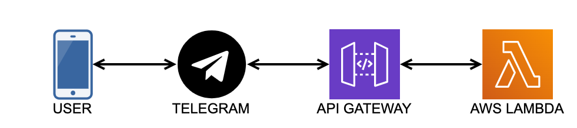

# Serverless Telegram Bot

### Description
Example of serverless Telegram Bot with [AWS Lambda](https://aws.amazon.com/lambda/?nc1=h_ls). The choice of AWS Lambda was quite obvious - low expenses to run and maintain my application (on-demand payments for invocations).

What does the bot do? Nothing special, just random facts about Ferdinand Magellan in Russian. If you are curious you can try it out and write the message https://t.me/CaptainMagellan_bot.

### Working Schema 

